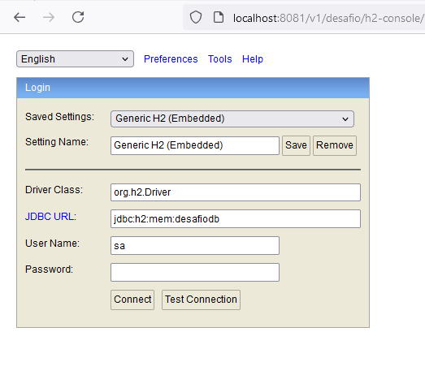
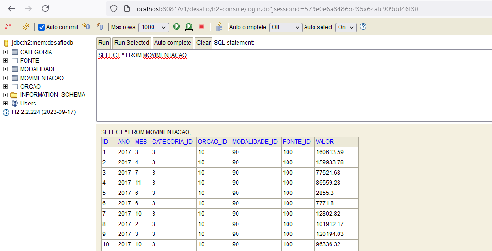
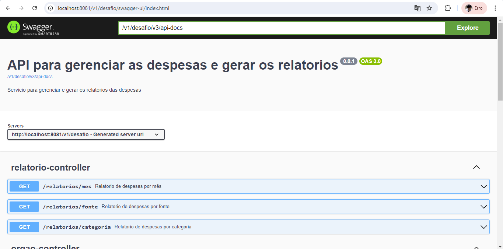
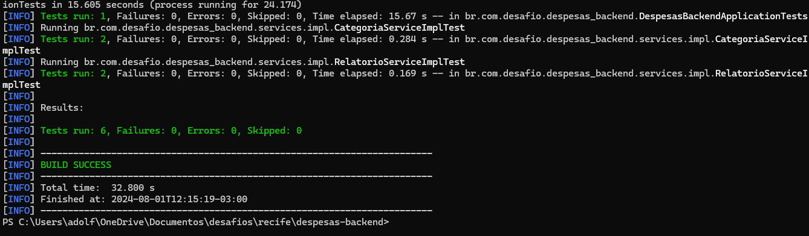
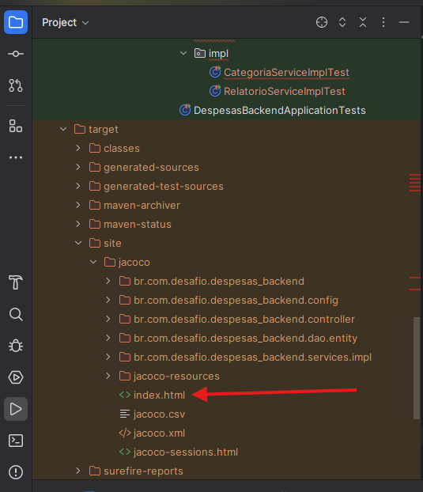
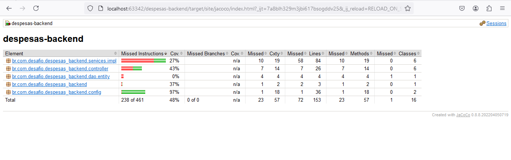

# despesas-backend

Proyecto BackEnd  que permite gerencias as despesas e gerar os dados dos relatorios.

### Requisitos Iniciales

| Herramienta | Version |
|:------------|:--------|
| Java        | 17.0.4  |
| Maven       | 3.8.6   |
| Spring Boot | 3.3.2   |
| Lombok      | 1.18.x  |

- Configurar Java, Maven y Lombok na rota local.
- Configurar o IDE do desenvolvimento

### Contexto do serviço

- /v1/desafio

### URL base del servicio

| Entorno      | URL base                          |
|:-------------|:----------------------------------|
|Desarrollo    | http://localhost:8081/v1/desafio  |
|Test          | http://localhost:8081/v1/desafio  |
|Produccion    | http://localhost:8081/v1/desafio  |

### Detalle del servicio

| Endpoint                    | Descripción                          |
|:----------------------------|:-------------------------------------|
| (GET) /movimentacoes        | Lista de movimentações de despesas   |
| (GET) /relatorios/mes       | Relatorio das despesas por mês       |
| (GET) /relatorios/categoria | Relatorio das despesas por categoria |
| (GET) /relatorios/fontes    | Relatorio das despesas por fonte     |

### Banco de dados

| Entorno   | Banco                | Rota de acesso                       |
|:----------|:---------------------|:-------------------------------------|
| Local     | h2                   | localhost:8081/v1/desafio/h2-console |
| Local     | username             | sa                                   |
| Local     | password             |                                      |

### Documentação API

| Entorno   | Libreria | Rota de acesso                                         |
|:----------|:---------|:-------------------------------------------------------|
| Local     | Swagger  | http://localhost:8081/v1/desafio/swagger-ui/index.html |

### TESTES UNITARIO

| Entorno   | Libreria | Execução       |
|:----------|:---------|:---------------|
| Local     | Junit    | mvn clean test |

### COVERAGE

| Entorno   | Libreria | Execução          |
|:----------|:---------|:------------------|
| Local     | Jacoco   | mvn clean install |

Logo de finalizar a execução do mvn clean install podera encontrar o relatorio da covertura de codigo na rota:
http://localhost:63342/despesas-backend/target/site/jacoco/index.html?_ijt=7a8blh329m3jbi617bsogddv25&_ij_reload=RELOAD_ON_SAVE

Tambem podera acessar ao index.html na pasta dentro do projeto:
target/site/jacoco

